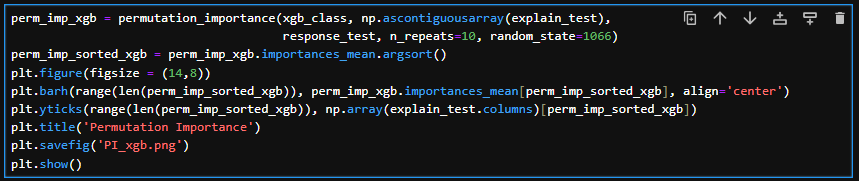

# ML-Bank-Churn
This is a machine learning exerxise that aims to predict if a bank customer is going to leave the bank or continue to be a costumer. Note that gradient-boosting frameworks XGBoost and LightGBM are used to perform this task.

The description can be found in:

https://www.kaggle.com/competitions/playground-series-s4e1/overview

The datasets can be accessed in this directory, or here:

https://www.kaggle.com/datasets/shubhammeshram579/bank-customer-churn-prediction/data

The project will be presented in the following structure:

**1. Data Access**

**2. Data Visualization**
   
**3. Data Preparation**
   
**4. XGB Classifier**   

**5. GBM Classifier**   

**6. ROC curves analysis**

*********************************************************************************************************************

# 1. Data Access

Let's load up the dataset and drop the instances/ observations which contain any missing piece:

There are 9998 client instance and 14 variables: 13 explanatory and 1 response variable.

# 2. Data Visualization
Let's have a look on how much clients left the bank. The "Exited" variable indicates if the client left the bank or not:

Now let's see all categorical and continuous variables in the dataset.

## a) Categorical Variables
A for-loop is used to visualize all categorical variables.

Gender classification of clients:

Number of years the customers with the bank:

Number of bank products clients using:

Do the clients have credit card (0 = no, 1 = yes)?

Where do the clients live?

Are the clients active members (0 = no, 1 = yes)?

## b) Continuous Variables
Similarly, a for-loop is used to visualize all continuous variables. Distribution of excited (orange) and current (blue) clients are shown for each continuous variable.

The credit score distributions:

Age distributions:

Account balance distributions:

Their salary?

## c) Correlation matrix
Now let's see the correlation matrix for all relevant variables. This matrix roughly shows the "relationship" between varaibles.

Irrelevant variables: 'RowNumber', 'CustomerID', 'Surname', 'Geography' are removed from the dataset.

The corresponding confusion matrix is shown in the following heat map:

# 3. Data Preparation
In this project, 90% of the data is used for training and 10% for testing. Again, our response variable is 'Exited' as we want to prediction if a client is staying (or not):

For each categorical variable, dummy variables are created for each type within the categorical variable. Also, "RowNumber", "CustomerID" and "Surname" are removed as they are irrelevant.

# 4. XGB Classifier
First we used XGB classifier to model and make prediction. Here are the key settings:
1. Logistic regression is used for this binary classification work.
2. Gamma = 1 (for branches pruning) and subsample = 0.9 to allow a flexible/complex model. The tree depth = 5 (~half of the number of paramter) and reg_lambda = 10 (for similarity and output calculation) to prevent overfitting.
3. Scale_pos_weight = 5 since it is expected that more than 80% of clients stay (else the bank has a SEROUS problem).
4. Only half features are used to train each tree.
5. Since it is a binary classification. Evaluation metric is set to be AUC. The training will stop when no improvement in 10 rounds.

Lets make some predictions and validate! It is easy to see the model's quality with a confusion matrix. True and predicted labels indicate the distributions in reality and model prediction. It looks like the number of false negative (FN) is high, but this is okay: The only focus for us is to prevent misclassifying those client, who is actually leaving the bank, into the staying group (We do not want high false positive!).

Of course, we would like to see what features affect most. The model indicates age, number of bank products (1~3) and active member status affect a client decision most.

Also, if the values within a feature are shuffled, how are their importance change? This permutation importance plot shows that the age and number of bank products (1~2) are important features (same as before).

# 5. GBM Classifier
The key settings of GBM classifier are basically the same as the LGB one, but it is worth to mention that not only auc, but log loss and mean accuracy are also used to evaluate.

Now let's see the confusion matrix. Same as before, we only want to prevent the high false positive result.

The feature importance:

And the permutation importance:

# 6. ROC analysis
Let's compare the models' quality. An useful tool to see a classifier’s performance is the ROC curve. The ROC curve indicates how the true positive (TP) rate (sensitivity) and false positive (FP) rate (1- specificity) change by varying the probability threshold in a classifier.

Each point of the curve contains TP and FP rate at a threshold. A perfect classifier would have the TP rate
= 1, and the FP rate = 0, where a perfectly random classifier would have a diagonal line as a ROC curve.
In principle, if the TP and FP rate are known at a given threshold, all matrix elements in confusion matrix can be
calculated. Essentially, the ROC curve captures all confusion matrices and the matrix elements for all thresholds.

It seems that both classifiers have almost same quality for this classification project, but LGB classifier may have a slightly better result:

*************************************************************************************************************************
# Conclusion and Business Insight

This project shows a possible way to predict whether a customer will stay or leave a bank, based on the past financial history of the bank's clients. Both XGBoost and Lightgbm give a similar result with good accuracy. However, XGBoost shows that "Age" and "Number Of Products" are important features for customer's decision, but Lightgbm shows that "Age", "Balance" and "Credit Score" are the ones.

More importantly, these features can help a bank to keep their clients. For example, the bank can establish new programs for different age groups, with different special offers (such as no monthly transaction fee for students/elderlies, low financing intereset rate for middle age). Another example would be providing high interest rate investment products such that clients are willing to apply more financial products and stay with the bank.
